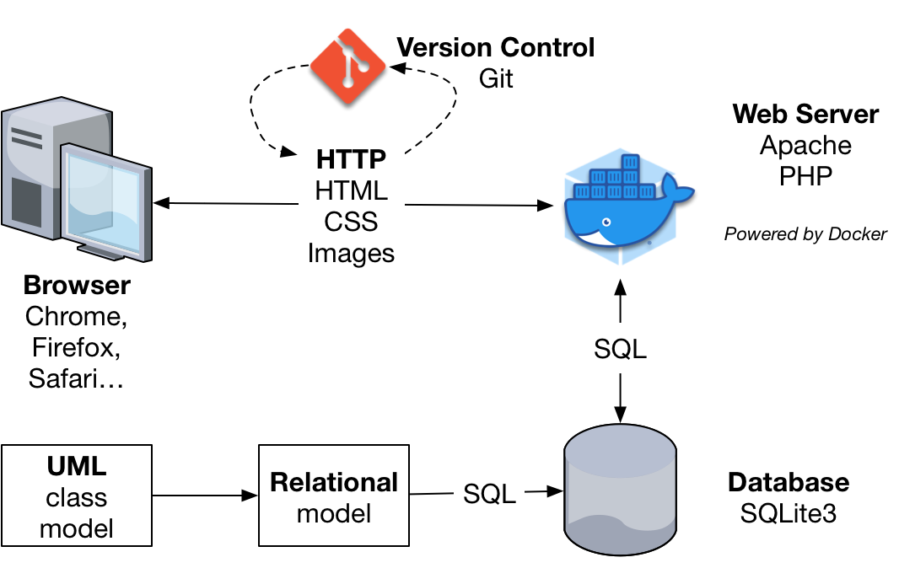



name: git
class: middle, center
template:inverse

# SIBD / ESIN
[João Rocha da Silva](https://silvae86.github.io/)

.footnote[Revised upon the [original](https://web.fe.up.pt/~arestivo/presentation/sibd/) by [André Restivo](https://web.fe.up.pt/~arestivo)]

---

template:normal

# Learning Outcomes

After completing this course you should be able to:

* Design a **relational database**
* Make **SQL** queries to relational databases
* Create and validate **HTML 5** documents
* Layout HTML 5 documents using **CSS**
* Create an **information system** implemented as a dynamic **web application** using PHP and relational databases
* Use **Git** to manage source code versions and work efficiently in a team
* Deploy your web application using **Docker**.

---

# Course Content

* UML Class Model
* Relational Model
* Relational Algebra
* Database creation using SQL
* Querying Databases using SQL
* Document Specification using HTML 5
* Document Presentation using CSS
* Dynamic Websites using PHP, HTML, CSS and SQL
* Version control using Git
* Website deployment using Docker

---

# Project

Implementation of an information system as a web application.

.center[.imgscaledup[]]

---

# Bibliography

## Main
* Michal Zalewski; *The tangled Web*. ISBN: 978-1-59327-388-0
* Jakob Nielsen; *Designing web usability*. ISBN: 1-56205-810-X
* Jeffrey D. Ullman, Jennifer Widom; *A First Course in Database Systems*. ISBN: 0-13-8687647-9
* Provided Slides

## Complementary
* Adrian Mouat; *Using Docker: Developing and Deploying Software with Containers*. ISBN: 978-1-49191-576-9
* Jon Loeliger, Matthew McCullough; *Version Control with Git, 2nd Edition*. ISBN: 978-1-44931-638-9

* Lots of Web resources and tutorials!

---

# Evaluation

* To obtain frequency, students may not exceed the maximum number allowed of missed classes. Attendance will be registered in practice sessions.
* It is necessary to obtain a minimum of **8 (out of 20)** in both the exam and the distributed evaluation component.
* Distributed evaluation refers to the design and implementation of an Information System project.

* Final mark = 0.5 * Exam + 0.5 * Project


