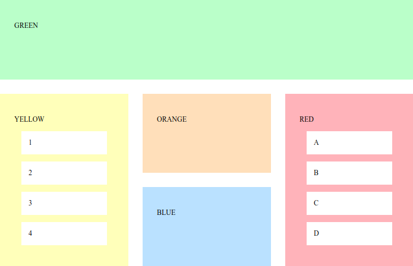
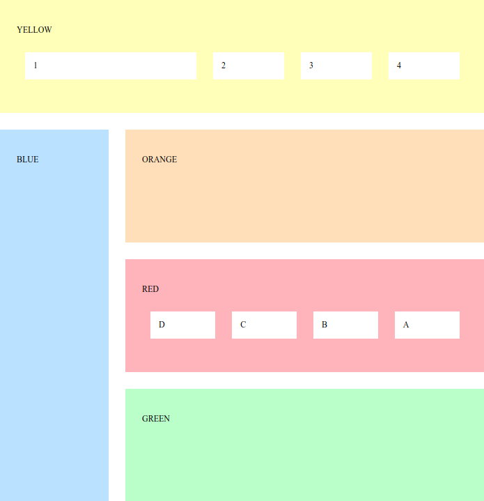

## Online newspaper design

- Unzip the following file into some folder: [news.zip](news.zip).
- You should have now 4 files: **index.html** (the main page of an online newspaper), **item.html** (a page representing a single article with comments), **register.html** and **login.html** (pages for users to register and login).
- Analyze the structure of these files.
- As you might have noticed, all pages reference 5 css files: **style.css** (styling the main components), **layout.css** (positioning the main components), **responsive.css** (making the page responsive), **comments.css** (design for the comments section) and **forms.css** (design for the login and register forms).
- Without changing the HTML files, try recreating a design by following these 5 steps:

### Main style

We will start by designing the main components of the main page without worrying about the positioning of any elements (**style.css**). The final result should be [this](news-style.html).

Some helper values:

- Main colors used: #2A2F33, #046DD5 and #F4655F.
- Section colors: #E1493E, #8ABA56, #5B4282, #FF8932, #19B6E9 and #E84C8B.
- Fonts used: Verdana and Georgia.
- Most paddings and margins are 1em.

Tip: You may have noticed that the nav section contains an input and a label. These are just to be used in exercise 1.3 You can start by hiding them using CSS for now.

### Positioning

Then we will position the elements in their proper places (**layout.css**). The final result should be [this](news-layout.html).

Some helper values:

- The background color is #EDEFF0.
- The width of the page is 60em.
- The sidebar occupies 1⁄5 of the total width.

Tip: Use a flexbox for the menu and a grid to position the elements in the page.

### Responsive Design

We will now make the design responsive by establishing two break points (**responsive.css**):

- When the width of the window reaches 60em, the sidebar should disappear and the page should occupy the full width (100%) of the window. The final result should be [this](news-tablet.html).
- When the width of the window reaches 30em, the menu should collapse into a pull-down menu, the subtitle should not be shown and each news item title should be moved to above the item image. The final result should be [this](news-phone.html).

Some helper values:

-	Characters for the hamburger menu: `\2630` (☰) and `\2715` (✕).

Tip: Start by making the menu without any animations (using display to hide and show the menu items). After that, try using *transitions* to change the height of each menu item instead.

### Comments Section

Add CSS rules (**comments.css**) to create the design for the comment section that can be seen in the item.html page. The final result should be [this](news-comments.html).

Some helper values:

Quote character for each comment: \201C (“).

### Forms Design

Add CSS rules (**forms.css**) to create the design for the register and login forms that can be seen in the **register.html** and **login.html** pages. The final result should be [this](news-register.html) .

Make sure that in smaller screens, the form fills the content area like [this](news-register-small.html) .

##  No FlexBox / Grid Design

**Without** using the flexbox and grid CSS layouts, try to recreate some designs.

- Copy the following HTML code: [news.html](/teaching/exercises/css/css3/html-template/) into a new *.html* file.
- Open it and observe its structure.
- As you might have noticed, this document references a, not yet created, file named *style.css* as its style sheet. Create that file and modify it so that the page appearance becomes as similar to the following designs as possible: style 1 , style 2 and style 3
- Style 2 uses the following image: 

Extra: Now try the same exercises, this time using flexbox and grid layouts.

## Blocks

- Unzip the following file into some folder: [blocks.zip](blocks.zip)
- Create a file called **style.css** and try recreating each one of the four following designs using Flexbox and Grid layouts:

###  Blocks Exercise - 1

- Use a flexbox layout for this one.
- Orange block uses the remaining space.

Colors used: #FDFFAC, #E9A1AC, #AEFFBD, #F0D4AA and #A6D1F5.

###  Blocks Exercise - 2

###  Blocks Exercise - 3

- First item in yellow block is three times the size of the others.
- Items in red block are reversed.
- Left column has 1⁄4 of the total width.

###  Blocks Exercise - 4

- Green and orange blocks have half the height of the red and yellow ones.

## Solutions for these exercises

[Solutions](/teaching/solutions/css/css3/)

## Acknowledgement

Exercises by [André Restivo](https://web.fe.up.pt/~arestivo/). Originals available [here](https://web.fe.up.pt/~arestivo/page/exercises/css/).
