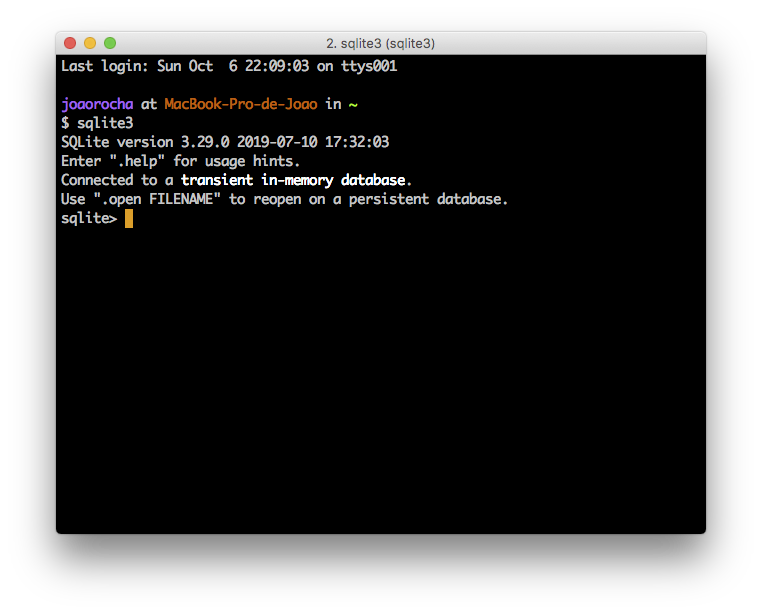
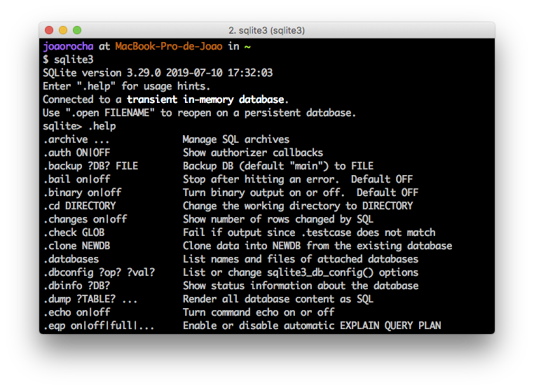

## About 

SQLite is a lightweight Database Management System (DBMS) which allows its users to implement a relational schema and run SQL queries over it, without the need for a standalone database server. This is convenient because the setup is minimal and the database can be easily bundled with application files.

SQlite is portable, which means that you can install it on any computer, even when you do not have Administration privileges. It is also quite interesting for mobile development in platforms such as Android or iOS.

SQLite implements ACID (Atomic, Consistent, Isolated, and Durable) transactions. This makes it possible to rollback all changes made during transactions in the event of a system crash or power loss.

SQLite does not, however, implement the [SQL Standard](https://en.wikipedia.org/wiki/SQL#Interoperability_and_standardization). 

For our classes we will be using [SQLite3](https://www.sqlite.org/download.html). 

## Installing SQLite3

All FEUP computers have sqlite3 already installed, so you should not need to carry out this step in those machines. If you want to install it in your personal laptop for home work or study, read on.

### Manual Installation (portable)

1. Download the precompiled binaries for `sqlite-tools` from the [website](https://www.sqlite.org/download.html) and unzip them to a folder in your computer. Please choose the appropriate file depending on your operating system (Windows, Linux or macOS).
   - For Windows, I recommend you unzip the download into `C:\sqlite3`. For other OS's you should use your home folder, like `~/sqlite3`.
2. Navigate to the folder where you extracted your download
3. You should see 3 files:

### Automatic installation 

#### macOS 

1. Install [HomeBrew](https://brew.sh)
2. Open Terminal  
3. Type `brew install sqlite3` and press Enter.

#### Linux (debian-based distros such as Ubuntu and derivatives)

1. Open Terminal emulator
2. Type `sudo apt-get update && sudo apt-get install sqlite3` and press Enter.

## Installing the Graphical User Interface

We will also be using a GUI (Graphical User Interface) to manipulate our SQLite databases. [SQLiteStudio](https://sqlitestudio.pl/index.rvt) is free and runs on every Operating System. Detailed installation instructions for Windows, Mac and Linux are available [here](https://sqlitestudio.pl/index.rvt?act=download).

### MacOS 
For macOS you can use [homebrew](https://brew.sh). Just run the following command: `brew cask install sqlitestudio`.

### Linux 

For Linux, unzip the installer in the [downloads page](https://sqlitestudio.pl/index.rvt?act=download). Open the Terminal, `cd` to the Downloads folder and make the installer executable by running the command `chmod +x ./InstallSQLiteStudio-3.2.1`. Then run it: `./InstallSQLiteStudio-3.2.1`. The installer should start up.

## Starting SQLite

### In a FEUP machine

1. Press the `Windows Key + R`. A small window will pop up. 
2. Type `cmd.exe` and press Enter.
3. A command line window will pop up.
4. Type sqlite3 and press Enter.
5. You will now be in the SQLite3 command line.

### In your own computer

To create a database you must first navigate to the folder where sqlite3 is installed. Assuming that you unzipped the downloaded files to `C:\sqlite` as previously explained, do this:

1. Press the `Windows Key + R`. A small window will pop up. 
2. Type `cmd.exe` and press Enter.
3. A command line window will pop up.
4. Type `C:`
5. Type `cd C:\sqlite3`
6. Type `sqlite3.exe` and press Enter.
7. You will now be in the SQLite3 command line.

## Creating your first database

When you first run `sqlite3`, any changes will be saved in memory only. This means that if you close the window, **all changes will be lost**.

You can see the list of all commands by typing `.help`:

## Useful commands

| Command           | Description                                                  |
| ----------------- | ------------------------------------------------------------ |
| **.databases**    | List names and files of attached databases                   |
| **.dump**         | Dump the database or a specific table in an SQL text format  |
| **.exit / .quit** | Exit the SQLite shell                                        |
| **.headers**      | Turn display of headers on or off, when displaying output of SQL statements |
| **.help**         | Show available commands                                      |
| **.import**       | Import data from a file into a table                         |
| **.mode**         | Set output mode                                              |
| **.open**         | Open a database from a file                                  |
| **.output**       | Redirect the output to a file                                |
| **.read**         | Execute SQL statements from a file                           |
| **.save**         | Write in-memory database into a file                         |
| **.schema**       | Show the CREATE statements used for the whole database or for a specific table |
| **.show**         | Show current values for various settings                     |
| **.show**         | List names of tables                                         |

