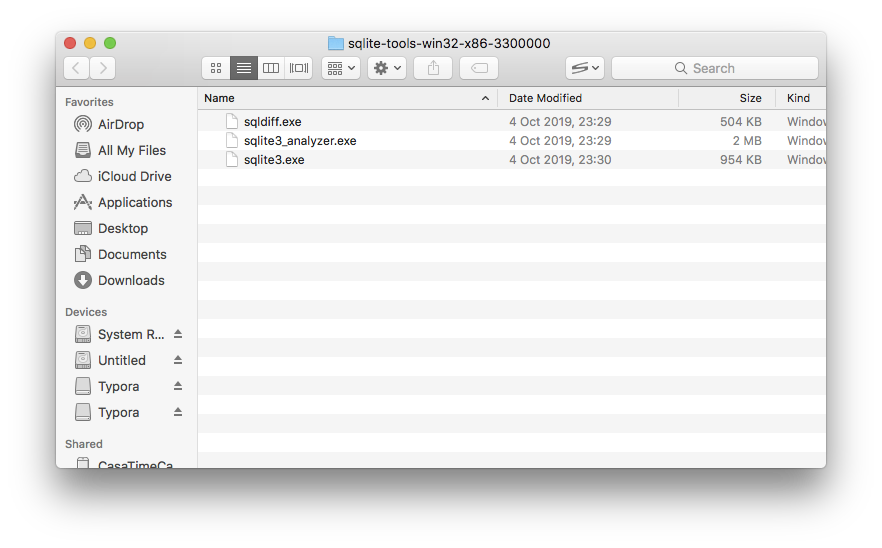

## About 

SQLite is a lightweight Database Management System (DBMS) which allows its users to implement a relational schema and run SQL queries over it, without the need for a standalone database server. This is convenient because the setup is minimal and the database can be easily bundled with application files.

SQlite is portable, which means that you can install it on any computer, even when you do not have Administration privileges.

For our classes we will be using [SQLite3](https://www.sqlite.org/download.html). 

## Installing SQLite3

All FEUP computers have sqlite3 already installed, so you should not need to carry out this step in those machines. If you want to install it in your personal laptop for home work or study, read on.

### Manual Installation (portable)

1. Download the precompiled binaries for `sqlite-tools` from the [website](https://www.sqlite.org/download.html) and unzip them to a folder in your computer. Please choose the appropriate file depending on your operating system (Windows, Linux or macOS).
   - For Windows, I recommend you unzip the download into `C:\sqlite`. For other OS's you should use your home folder, like `~/sqlite`.
2. Navigate to the folder where you extracted your download
3. You should see 3 files:

### Automatic installation 

#### macOS 

1. Install [HomeBrew](https://brew.sh)
2. Open Terminal  
3. Type `brew install sqlite3` and press Enter.

#### Linux (debian-based distros)

1. Open Terminal emulator
2. Type `sudo apt-get update && sudo apt-get install sqlite3` and press Enter.

## Installing the Graphical User Interface

We will also be using a GUI (Graphical User Interface) to manipulate our SQLite databases. [DB Browser for SQLite](https://sqlitebrowser.org) is free and runs on every Operating System. Detailed installation instructions for Windows, Mac and Linux are available [here](https://sqlitebrowser.org/dl/).

## Creating your first database

 

