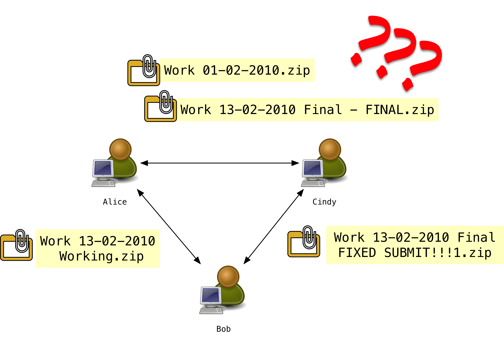
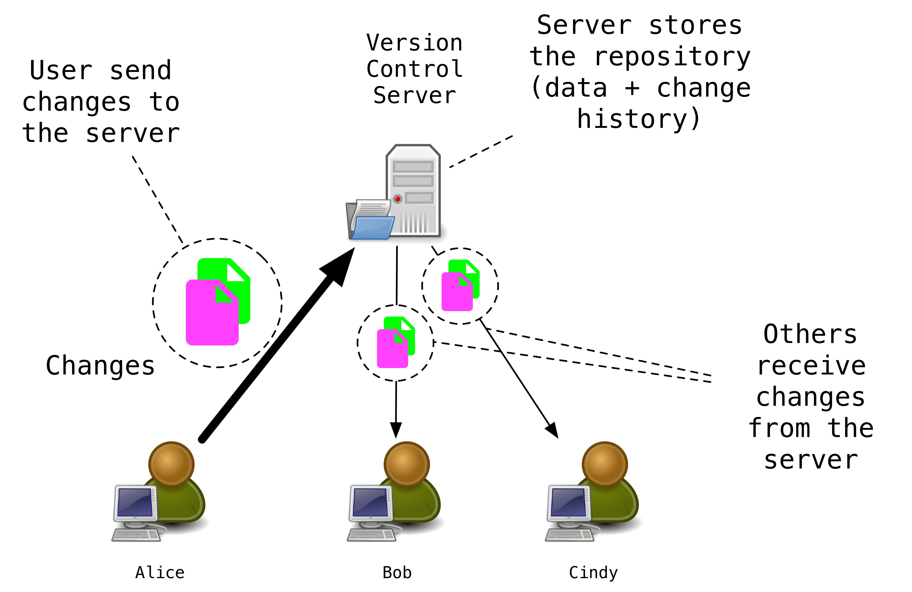
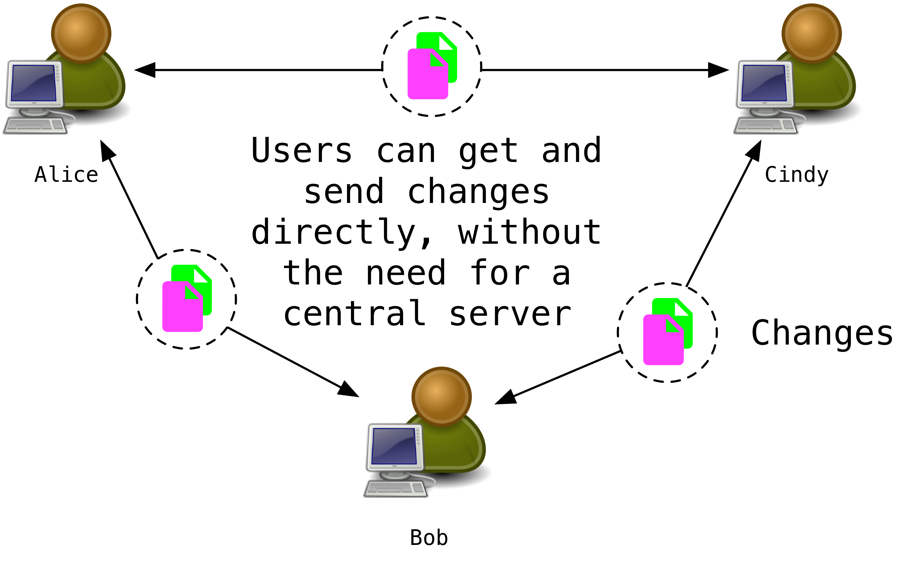
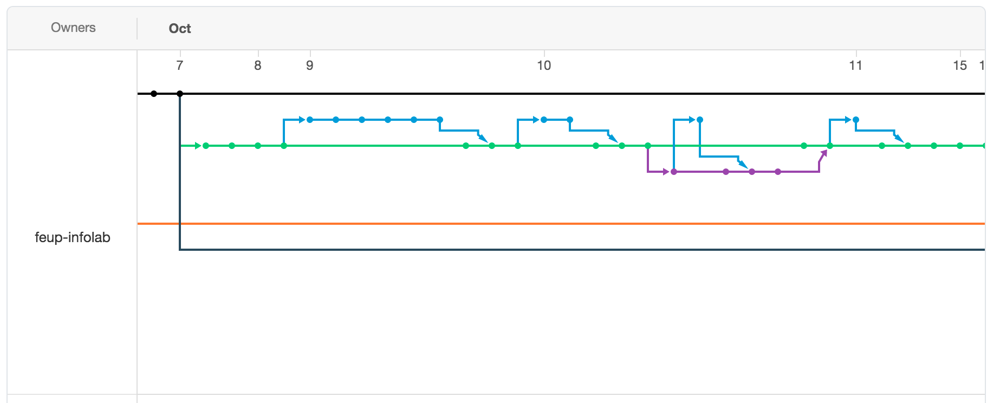
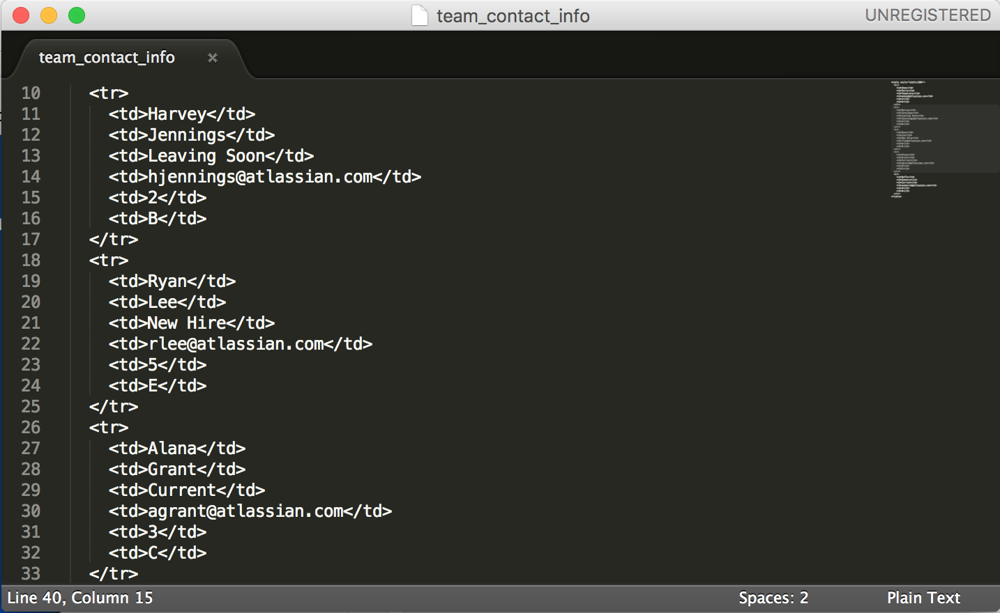
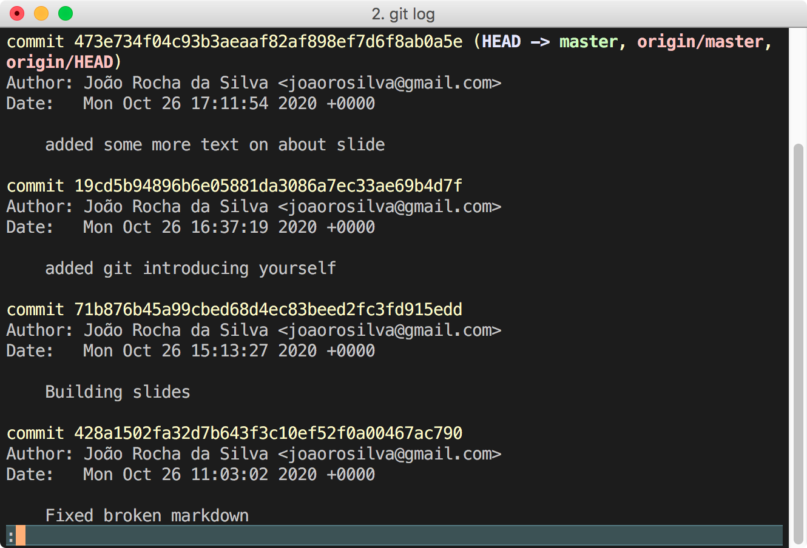



name: git
class: middle, center
template:inverse

# Git
[a distributed version-control system]

## Introduction and Basics
by [João Rocha da Silva](https://silvae86.github.io)

---
name: agenda
class: middle, center

## Agenda
.index[

.indexpill[[About](#about)]

.indexpill[[References](#references)]

.indexpill[[None/Centralized/Distributed VCS](#none-vs-centralized-vs-distributed)]

.indexpill[[History](#history)]

.indexpill[[Introducing yourself](#introducing-yourself)]

.indexpill[[Repository from scratch](#repository-from-scratch)]

.indexpill[[Cloning a repository](#cloning-a-repository)]

.indexpill[[Adding changes](#adding)]

.indexpill[[Checking status](#checking-status)]

.indexpill[[Committing ](#committing)]

.indexpill[[Pushing](#pushing)]

.indexpill[[Pulling](#pulling)]

.indexpill[[Fetching](#fetching)]

.indexpill[[Branches](#branches)]

.indexpill[[Merging](#merging)]

.indexpill[[Conflicts](#conflicts)]

.indexpill[[Change log](#log)]

.indexpill[[GitHub](#github)]

.indexpill[[TL;DR](#tl-dr)]

]

---
name: about
## About

- A **distributed** source code **version control** system.

- **Distributed**, because it does not require a **repository server**
	- All collaborators of the repository can synchronize their code without the need for a "central authority"

- **Version control** because it tracks all changes made to the code of a software solution

- Keeps your code safe and bugs easy to blame 👻, as the authors of all changes are recorded! 

.footnote[.red[*]We will cover some basics of Git usage in these slides. More advanced usage can be explored in the bibliography.]

---
name: none-vs-centralized-vs-distributed
## None/Centralized/Distributed VCS (1/3)

### No Version Control System

.center[.imgscaledup[]]

---

## None/Centralized/Distributed VCS (2/3)

### Centralized VCS

.center[.imgscaledup[]]

---

## None/Centralized/Distributed VCS (3/3)

### Distributed VCS

.center[.imgscaledup[]]

---
name: history
## History

| | Name                      | Acronym | Type          |
| ---- | ------------------------- | ------- | ------------- |
| 1986 | Concurrent Version System | CVS     | Centralized   |
| 2001 | Subversion                | SVN     | Centralized   |
| 2000 | BitKeeper                 | -       | Decentralized |
| 2005 | Mercurial                 | Hg      | Decentralized |
| 2005 | Git                       | -       | Decentralized |


---
name: introducing-yourself

## Introducing yourself

Before performing any operations using `git`, you should specify your **user name** and **email**.

```bash
git config --global user.name "Your Name Comes Here"
git config --global user.email you@yourdomain.example.com
```

This allows you to mark every change made to the code with your information, so everyone in the repository knows who did what. 

---
name: repository-from-scratch
## Creating a repository

You can initialize a Git repository from existing sources in a folder or create a completely blank repository if you initialize it in an empty folder. 

```bash 
cd /path/to/folder/to/make/into/repository
git init
```

A new hidden.red[*] directory called `.git` will be created inside the `/path/to/folder/to/make/into/repository` folder. This folder contains the information that Git needs to manage the repository.

.footnote[.red[*] Unless you turn on "Show hidden files" in Windows]

---
name: adding
## Adding changes

- To add files to version control of the repository (so that Git starts "seeing" them), Git provides the `git add` command.
- To add all the files and folders inside our repository, we will use
- The *current state* of all files and folders is added to the *index* (a temporary staging area of Git). 

```bash
cd /path/to/folder/to/make/into/repository # go to repository folder
git add . # make everything part of the repository
```

- "**Git tracks content, not files**: Many revision control systems provide an `add` command that tells the system to start tracking changes to a new file. Git’s `add` command does something simpler and more powerful: `git add` is used **both for new and newly modified files**, and in both cases it takes a snapshot of the given files and stages that content in the index, ready for inclusion in the next commit."(.red[[Source](https://git-scm.com/docs/gittutorial)]).

---
name: making-changes
## Making changes

1. Edit some files inside the repository, using any editor you want. 
	- Git also manages changes to binary files, such as images or sqlite3 databases (".db files").
2. Add changes
	- You can add all the changes changes within the entire folder:
	```bash
	git add . 
	```
	- ... or only the changes made to files `home.php` and `static/images/products.png`:
	```bash
	git add home.php static/images/products.png
	```
	
.footnote[.red[*] Empty folders will not be added to the index by default. This is a behavior of Git that you can circumvent by creating a dummy file inside the folder whose addition you want to force.]

---
name: diff 
## Pending changes

- You can see any changes made to the repository files that have **not** been added to the *index*, using the command

```bash
git diff
```

- After adding changes to the index you can see what **has been added**

```bash
git diff --cached
```

These commands are good to see what is *in the index* (sometimes called "staged") before you `commit` anything.

---
name: checking-status
## Checking status

Another way to get an overview of the changes that are to be `commit`ted, you can use `git status`:

```bash
$ git status
On branch master
Changes to be committed:
Your branch is up to date with 'origin/master'.
  (use "git restore --staged <file>..." to unstage)

	modified:   home.php
	modified:   static/images/products.png
```

---
name: committing
## Committing changes

- To permanently store the contents of the index in the repository you must create a commit:
	```bash
	git commit
	```

	1. You will be prompted to enter a commit message, using the default command-line editor.
		- To change the default editor (often `nano` in Linux distros):
		```bash
		# this will replace 'nano' with 'vim' as the default editor 
		# used by git, for those that prefer 'vim'
		git config --global core.editor "vim" 
		```
	2.  Enter your commit message (**write good descriptions of the changes, as everyone will see them**) and exit the editor. Git will immediately commit the changes as soon as the editor closes.
- You can also use command line arguments as a "shortcut" to 1. Add everything in the current folder to the index, 2. Commit those changes (aka "Staging changes") and 3. Specify the commit message in one go:
	```bash
	git commit -a -m "Fixed security hole in the authentication module (reported in issue #1291). Replaced md5 with bcrypt for the password encryption."
	```

---
name: cloning-a-repository
## Cloning an existing repository

Cloning allows you to collaborate with other users without having to use a central server (hence *distributed* version control).

Alice and Bob are building a website, and Bob wants to make some changes to Alice's code.

- Alice has a repository on her home directory, at `/home/alice/website`.
- Bob wants to clone Alice's repository to work on his machine and send the changes later. 

How can Bob do it?

- Bob accesses Alice's machine to clone the repository.red[*]: 
	```bash
	git clone alice.org:/home/alice/website /home/bob/myrepo
	```
- Bob's repository clone, at Bob's machine, will be on equal footing with the original project, with an exact copy of the entire history of the project.
	
.footnote[.red[*] She could use the `ifconfig` command on UNIX and `ipconfig` on Windows or give Bob her IP address if they are both on the same network, or give him the public domain of her machine, e.g. `alice.org`]

---
name: pulling
## Pulling changes

- After Bob made his improvements to the code, Alice wants to add them to her version of the website.
- To pull the changes made by Bob, Alice runs the commands:

```bash
cd /home/alice/website # change to the website's folder on Alice's computer
git pull . bob.org:/home/bob/myrepo master # perform the pull operation
```
- Here is the meaning of the command, split into its parts:
	- `git pull` tells git to pull changes from another repository
	- `.` current folder will be the destination of the changes pulled
	- `bob.org:/home/bob/myrepo` fetch from the repository at `/home/bob/myrepo` folder at Bob's computer (network address `bob.org`)

- The changes contained in the commits that Bob performed in his local repository will be retrieved and merged in Alice's local repository. 

- Alice should `add` and  `commit` any current changes to her own repository before `pull`ing any changes from other repositories. This will make it easy to solve conflicts, e.g. two users edited the same line of the same file (we will see these later).

---
name: fetching
## Fetching changes

Instead of directly pulling the changes from Bob, Alice can first *take a peek* at his repository to see if he has any changes worth pulling into her own code, without making any changes to her code. 

- Alice can define a `remote` from which she pulls changes regularly, using:

```bash
git remote add bob bob.org:/home/bob/myrepo
```
- Here is the meaning of the command, split into its parts:
	- `git remote add` tells git to add a new remote repository 
	- `bob` short, easy to memorize name for the new remote repository
	- `bob.org:/home/bob/myrepo` location of the remote repository

- Alice can then fetch the changes committed by Bob in his repository:
```bash
git fetch bob
```

---
name: pushing
## Pushing your commits

- Git can work much like CVS (a centralized version control system), where you can `push` your changes to a remote server. This is the way GitHub works.
	- After you clone from GitHub, you can `add` changes, make several `commit`s and finally push those commits to the GitHub repository from where you cloned. 
	- Before you `push` any changes you need to see if anyone has pushed anything to the repository since you last `pull`ed from it.
	- If anyone `push`ed changes to files that you also modified, a merge conflict will appear. 
- Fixing conflicts
	- You will have to manually merge the files marked as conflicted (use `git status` to see which files have conflicts after `pull`ing)
	- After the conflicts [have been fixed](#conflicts), you can use `git add home.php` to set the fixed file as the version to be `commit`ted over whatever is in the remote repository.
	- To persist the changes, run `commit` and `push` to send the merged changes to the GitHub repository.

---
name: branches
## Branches - Purpose (1/2)

- Sometimes you want to work on a new feature for the project that is too large to be committing changes as you progress in your work without breaking the main code until the entire feature is finished.
- Without version control, you would simply copy-paste the entire folder, implement the entire feature, and then go file by file to copy all the changes made during the implementation of the feature 😱😱😱
- A single Git repository can maintain multiple branches of development, so that commits to one branch do not affect the others.

---
name: branches-2
## Branches - Creating and switching (2/2)
 
- To create a new branch named "new-feature", use:
	1. 
	```bash
	git branch new-feature
	```
	2. Your new branch will be created:
	```bash
		git branch
			new-feature
			* master # Star denotes your current branch
	```
	3. Switch to the newly-created branch `new-feature`. All add and commit operations will affect that branch instead of the default `master` branch, which should be used for the main, stable version of your app. 
	```bash
	git switch new-feature
	(edit file)
	git commit -a -m "A change made in the new feature".
	```
	
---
name: merging
## Merging one branch into another

1. To *merge* the changes from a branch into the master branch:
	```bash 
	git switch master
	```
2. Merge `new-feature` into master. It is always like a "pull", you first *switch to the destination branch* and then merge *from the origin branch*.
	```bash 
	git merge new-feature
	```
3. If there are no conflicts, you are done. Otherwise, you need to [resolve them](#conflicts). 

.center[.imgmd[]]

- Representation of branching and merging in a real project. Dots are commits, arrows are the branching and merging operations.


---
name: conflicts
## Conflicts - Why do they happen? (1/3)

- You `pull` from a remote repository or you try to `merge` your new branch into the main repository branch.
- You get conflicts (use `git status` to see the files with conflicts)
- You open one of the conflicted files and you see something like this.red[*]:

.center[.imgfull[]]
.footnote[.red[*]Image credits: [Atlassian](https://support.atlassian.com/bitbucket-cloud/docs/resolve-merge-conflicts/).]

---
name: conflicts-2
## Conflicts - Spotting (2/3)

.center[.imgfull[]]

- A: Start of the changes in the local branch (i.e. your changes)
- B: Delimiter - End of the changes in the local branch and start of the changes in the remote branch
- C: End of the changes present in the remote repository (i.e. that someone `push`ed after your last `pull`)

.footnote[.red[*]Image credits: [Atlassian](https://support.atlassian.com/bitbucket-cloud/docs/resolve-merge-conflicts/)].


---
name: conflicts-3
## Conflicts - Fixing (3/3)

1. Remove the change designations added by Git (A, B, and C [here](#conflicts-2)).
2. Correct the content and save. The result will look something like this:
	.center[.imgmd[]]
3. See if you missed any conflicts. Run a quick `Ctrl+F` search for `<<<<<<`, for example (this sequence appears in all conflicts but rarely in actual source code). Fix if needed.
4. Add and commit the changes, push if you wish
	```bash
	git add <filename>
	git commit -m'commit message'
	git push # Push the changes to the main repository if you wish.
	```
.footnote[.red[*]Image credits: [Atlassian](https://support.atlassian.com/bitbucket-cloud/docs/resolve-merge-conflicts).]

---
name: log
## Change log

To see the history of changes in a Git repository, you can run `git log`.red[*]:

.center[.imgmd[]]

- For every commit, you can see the author, its date and time, and the associated message as written by the author of the commit. 
- The *hash sum* is a long, unique identifier of the state of the repository at that exact point in time, useful for restoring after someone makes mistakes.

.footnote[.red[*]This is the actual log of the commits to the [repository](https://github.com/silvae86/silvae86.github.io) where the source code for these slides is.]

---
name: help
## Getting help

To get help about `git` command-line operations, you can enter the following commands:

```bash
man git-log # will show the manpage of git, for the log command
```

alternatively:
```bash
git help log # ask git to show help about the log command
```

---
name: tl-dr
## TL;DR

- A **repository** is a folder with some files added by the VCS. 
	- In `Git`, the root of the folder will contain an *invisible* `.git` folder with information that it uses to keep track of the changes made to everything in that folder.
- **Cloning** is to create a local copy of a repository present at some remote location
- **Changes** are calculated automatically by Git whenever a file inside a repository is edited. They refer to lines added, removed or modified in all the files in the repository, as well as files added, deleted or renamed.
- **Commits** are similar to milestones on a road: they are used to "mark" the current state of the repository as a milestone. When you commit your changes you are only modifying the local copy of the repository. Nothing will be *sent* anywhere.
- **Pulling** means to retrieve the latest changes present in a remote branch
- **Pushing** is to send all your local commits i.e. to send all changes made locally back to the remote
- **Branches** are like the branches on a tree. You can branch out your code to work separately on a certain functionality. When you think it is stable, you can **merge** it back into the main branch, which is like the trunk of a tree
- **Merging** is to merge all the changes made in a separate branch back into the main branch of the repository.


---
name: references
## References

- *[Version Control with Git, 2nd Edition](https://www.oreilly.com/library/view/version-control-with/9781449345037/)* 
	Loeliger, J., & McCullough, M. (2012).  
	O'Reilly Media, Inc.
	- A complete book on using Git, from the basics to mastery.
- *[gittutorial - A tutorial introduction to Git](https://git-scm.com/docs/gittutorial)*
	- **The** introduction to Git, by its makers.
- *[Git for Version Control](https://courses.cs.washington.edu/courses/cse403/13au/lectures/git.ppt.pdf)*
	Software Engineering, Paul G. Allen School. 
	- A set of slides similar to these, explaining Git concepts
- *[Resolve merge conflicts](https://support.atlassian.com/bitbucket-cloud/docs/resolve-merge-conflicts/)*
	Atlassian.
	- An uncomplicated guide on fixing conflicts in Git. 
- *[Git Commands on GitHub](https://github.com/joshnh/Git-Commands)*
	joshnh on GitHub
	- An interesting *cheat sheet* for command-line (advanced) use of Git*



