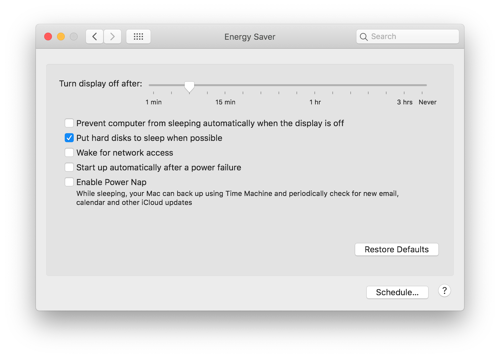

Do you have a hackintosh that wakes up immediately after sleeping? Try these possible solutions:

### Make sure that Power Nap is off

Power Nap is a feature that allows a Mac to perform certain tasks while sleeping (fetching email, updating iCloud, etc.). It requires some specific hardware to work---hardware that is not present in a Hackintosh. 

### Check out the current sleep settings

